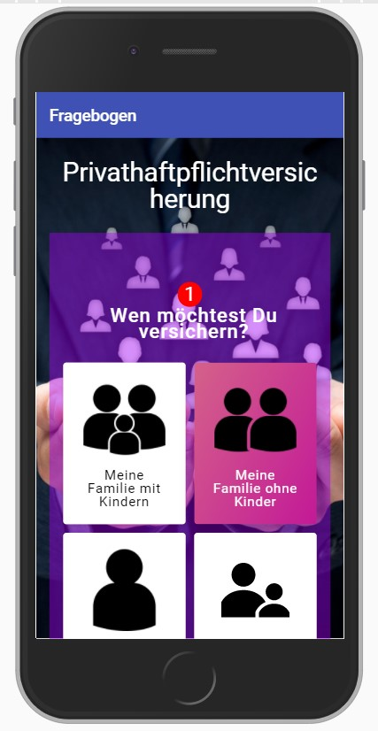
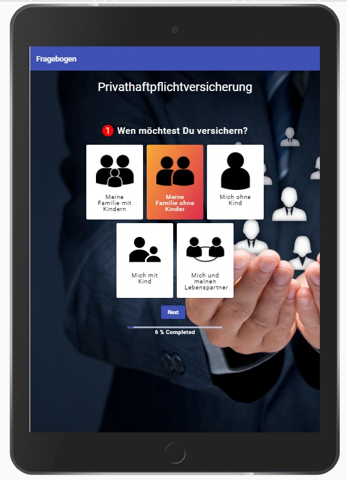
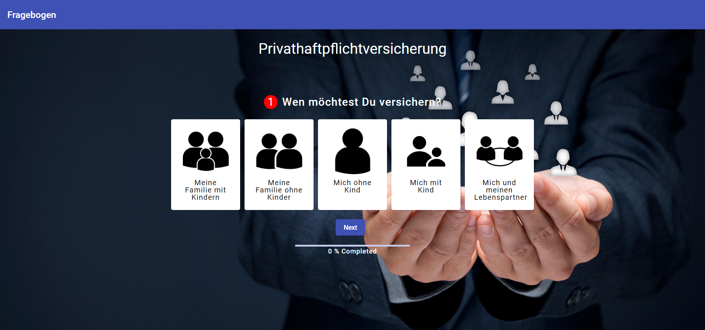
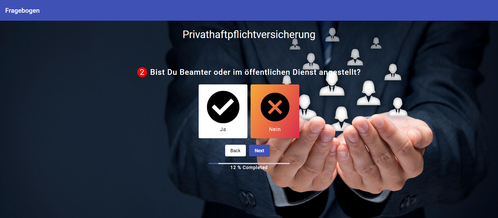
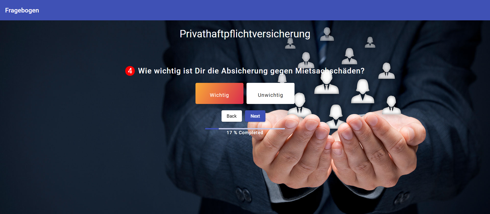

# Angular-10-Animated-Questionnaire
  
This project was generated with [Angular CLI](https://github.com/angular/angular-cli) version 10.

## How To install and run this repository in your local machine

Use git clone or download the folder to your local machine. Then run 

    npm install 

to download the required node modules in your downloaded folder. Then start the application using
	
    ng serve -o 

which opens the application in localhost:4200 and your system requires a recent Node version installed for running above code.

# Questionnaire Details

* The application is in Angular 10 with recent version of Node and used Angular material component library, SCSS, flexbox layout module. 
* Angular Animations is used for animating the contents 
* Application Unit testing is done with Karma and Jasmine with 100% code coverage. 
* Application is fully responsive.
* Questionnaire	is	based	on	a	JSON	that	the	frontend	uses	to	drive	the	questions
* Angular Two-way Binding is used for storing answers so users can go back and forward without losing the answers.
* Questionnaire Questions are in German or deutsch Language
* User	can	go	back to	a previous question	without	losing the answers given in a current question
* Completion progress is shown with a progress bar.
* Customized and Stylish Boxes and icons instead of normal radio buttons.

# Questionnaire Features

Concepts:
* Questionnaire
- A	Questionnaire	has	a	title	and	a	description
- A	questionnaire	has	a	defined	sequence	of	question	that	need	to	be	answered
* Question
- 2	different	types	of	questions	are	supported:	Freetext(text/text-area),	Multiple	choice	(single	answer)
- For	Multiple	Choice,	each	choice	has	a	descriptive	label	that	is	shown	to	the	user

## Build

Run `ng build` to build the project. The build artifacts will be stored in the `dist/` directory. Use the `--prod` flag for a production build.

## Running unit tests

Run `ng test` to execute the unit tests via [Karma](https://karma-runner.github.io).

## Running end-to-end tests

Run `ng e2e` to execute the end-to-end tests via [Protractor](http://www.protractortest.org/).

## App Screenshots

* Mobile - Answer Selected

* Mobile - Questionnaire Completed

* ipad - Answer Selected

* ipad - Questionnaire Completed

* laptop -  Lander Question 

* laptop - Answer Selected

* laptop - Question with yes or no answers

* laptop -  Normal Multiple Choice Questions with Single Answer

* laptop -  Questionnaire Completed

* Code Coverage

## Further help

To get more help on the Angular CLI use `ng help` or go check out the [Angular CLI README](https://github.com/angular/angular-cli/blob/master/README.md).
